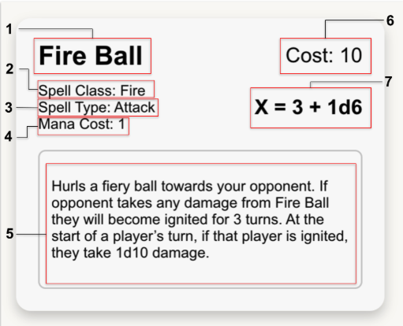

# 🧙 Wizard V Warlocks

**Wizard V Warlocks** is a turn-based multiplayer game where players engage in magical combat using strategically chosen spells. Create a custom character, build your spellbook, and challenge other players in fast-paced, tactical duels.

---

## 🎮 Gameplay Overview

After creating a character, players purchase spells from the Shop and equip them in preparation for battle. In a match, both players cast spells simultaneously until one player's health reaches zero.

Winning requires understanding your opponent’s strategy, managing resources wisely, and countering effectively. Win matches, earn gold, and expand your collection of powerful spells!

---

## 🧾 Table of Contents

- [Creating an Account](#-creating-an-account)
- [Character Creation](#-character-creation)
- [Buying Spells](#-buying-spells)
- [Equipping Spells](#-equipping-spells)
- [Interpreting a Spell](#-interpreting-a-spell)
- [Game Turn Walkthrough](#-game-turn-walkthrough)
- [Spell List](#-spell-list)
  - [Attack Spells](#%EF%B8%8F-attack-spells)
  - [Block Spells](#%EF%B8%8F-block-spells)
  - [Recharge Spells](#-recharge-spells)
  - [Heal Spells](#-heal-spells)
  - [Passive Spells](#-passive-spells)
- [Balance Changes & Fixes](#%EF%B8%8F-balance-changes--fixes)

---

## 🧙 Creating an Account

1. Visit the **Wizard V Warlocks** signup/login page.
2. Use a unique password. The game is secure, but low stakes — choose something simple.
3. Use the access code: `Eaip684Om79LRFjj`
4. Sign up and log in to begin your journey!

> ⚠️ Recommended browser: **Google Chrome** (other browsers are supported via testing)

---

## 🧝 Character Creation

Upon first login:

- Customize appearance
- Distribute **4 stat points** between:
  - **Health** (+20 HP per point)
  - **Mana** (+1 starting mana per point)
  - **Class Multiplier** (+0.1 boost to spells of chosen class)

Choose a class: **Fire**, **Water**, or **Electric**.

You may reset your class/stat allocation later for **50 gold**.

---

## 🛒 Buying Spells

Visit the **Shop** to buy spells (each costs **10 gold**). Spells display:

- Type (Fire, Water, Electric)
- Role (Attack, Defense, Heal, etc.)
- Dice Formula (e.g., `X = 2 + 1d4`)

Once purchased, equip spells on the **Equip** page.

---

## 🧰 Equipping Spells

- Equip up to **6 active spells**
- Change your loadout on the **Equip** page
- Strategically prepare your spell list for upcoming battles!

---

## 📜 Interpreting a Spell

     

Each spell includes:

- **1. Name:** The name of the spell.
- **2. Spell Class:** Fire, Water, Electric, All, or None.
- **3. Spell Type:**  Attack, Block, Healing, Recharge, Passive, None, or All.
  - **Attack:** Deals damage to the opponent.
  - **Block:** Prevents incoming damage.
  - **Recharge:** Restores the caster’s mana.
  - **Healing:** Restores the caster’s health.
  - **Passive** Provides various effects, often granting beneficial modifiers to future spells.
- **4. Mana Cost** The minimum amount of mana required to cast the spell.
- **5. Spell Description & Additional Effects:** A brief explanation of the spell’s effects. For example, the spell above deals **direct damage** and also applies the ignite status effect for three turns, which causes the opponent to take **1d10 damage at the start of their turn**.
- **6. Gold Cost** The amount of gold required to purchase the spell.
- **7. Base Dice Formula** The spell’s base effect when cast for its minimum mana cost.

> Example Charging Formula:  
> For a base spell `3 + 1d6`, casting it with 2 mana becomes `6 + 2d6`.

---

## 🔄 Game Turn Walkthrough

### 1. Spell Casting (2-minute timer)

- Select a spell
- Optionally charge it using the slider
- Cast the spell

### 2. Resolution

- Spells resolve **simultaneously**
- Damage and effects are displayed
- Mana usage is **hidden**

### 3. Repeat until one player's health ≤ 0

- Winner earns **10 gold**
- Return to the home screen

---

## 📖 Spell List

### ⚔️ Attack Spells

| Name | Damage | Mana | Chargeable | Gold | Ability |
|------|--------|------|------------|------|---------|
| Fire Ball | 3 + 1d6 | 1 | ✅ | 10 | Ignite for 3 turns |
| Draconic Breath | 3 + 1d8 | 1 | ✅ | 10 | Overflow bypasses block |
| Water Jet | 3 + 1d4 | 1 | ✅ | 10 | Fire spells deal half this turn |
| Freeze Spell | 4 + 1d4 | 1 | ✅ | 10 | Freezes opponent for 1 turn |
| Lightning Bolt | 5 + 1d4 | 1 | ✅ | 10 | Hits first |
| Heavenly Lightning | 40 | 4 | ❌ | 10 | None |
| Magic Missile | 5 + 1d6 | 1 | ✅ | 10 | None |

**Status Effects**  
- **Frozen**: Spell cost doubles  
- **Ignited**: 1d10 damage at start of turn

---

### 🛡️ Block Spells

> Damage through a block is halved unless otherwise stated.

| Name | Block | Mana | Chargeable | Gold | Ability |
|------|-------|------|------------|------|---------|
| Ward | 8 + 1d6 | 1 | ✅ | 10 | None |
| Force Field | 54 | 3 | ❌ | 10 | None |
| Fire Field | 6 + 1d6 | 1 | ✅ | 10 | Blocks extra electric damage |
| Water Field | 6 + 1d6 | 1 | ✅ | 10 | Blocks extra fire damage |
| Electric Field | 6 + 1d6 | 1 | ✅ | 10 | Blocks extra water damage |

---

### 🔋 Recharge Spells

| Name | Mana Gained | Gold | Ability |
|------|-------------|------|---------|
| Recharge | 2 | 10 | None |
| Chaotic Energy | 1 + 1d4 | 10 | Take 1d10 damage |
| Swap | 1 | 10 | Swap active spells |
| Energy Steal | 0 | 10 | Gain mana = half damage taken (max 8) |
| Observe | 1 | 10 | View opponent’s spells, health, mana |

---

### 💖 Heal Spells

| Name | Healing | Mana | Chargeable | Gold |
|------|---------|------|------------|------|
| Heal | 2 + 1d4 | 1 | ✅ | 10 |

---

### 🌀 Passive Spells

| Name | Modifier | Mana | Applies To | Gold | Duration |
|------|----------|------|------------|------|----------|
| Fortify Attack | 1.35 | 1 | Attack | 10 | Next attack |
| Fire Rune | 1.25 | 1 | Attack & Block | 10 | Permanent |
| Water Rune | 1.25 | 1 | Attack & Block | 10 | Permanent |
| Lightning Rune | 1.25 | 1 | Attack & Block | 10 | Permanent |

---

## 🛠️ Balance Changes & Fixes

### Patch 0.1.2

#### Balance Changes
- **Observe**: Now restores 1 mana

#### Bug Fixes
- Fixed in-game reload bug
- Timer crash bug fixed

#### Updates
- Improved support for reload/back/forward
- UI updates for turn selection
- Pet cosmetics added!

---

### Patch 0.1.1

#### Balance Changes
- **Chaotic Energy**: Reduced recharge, increased damage
- **Ignite**: 1d10 damage (up from 1d6)
- **Fortify**: Modifier lowered (1.5 → 1.35)
- **Lightning Bolt**: Damage nerfed (6 + 1d6 → 5 + 1d6)
- **Observe**: Mana cost now 0
- **Swap**: Restores 1 mana

#### Fixes & Features
- Observe display bug fixed
- Swap functionality fixed
- Spells preloaded for smoother matches
- Match winners now earn 10 gold
- Rune spells updated to apply to both attack & block
